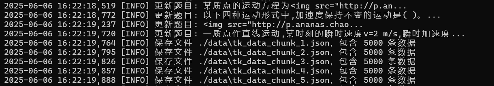

# 本地查题接口题库API

## 项目概览

这是一个基于Flask的题库API，用于管理和查询包含33万道题目的数据集。支持题目查询、更新和插入，具备文本清理、图片路径标准化和分片JSON存储功能，优化大规模数据处理。可与OCS网课助手无缝对接。



## 功能

- **查询接口 (`/cx`)**：根据题目文本和可选类型（单选、多选、判断、填空）获取答案。
- **更新接口 (`/cx_update`)**：新增或更新题目和答案。
- **健康检查接口 (`/health`)**：检查API状态和题目总数。
- **大规模数据处理**：管理33万道题目，数据分片存储（每文件5000题）。
- **文本标准化**：清理题目文本和图片路径，确保查询一致性。
- **日志记录**：详细日志，便于调试和监控。
- **OCS网课助手对接**：支持通过JSON配置与OCS网课助手集成，自动查询和处理题目。

## 环境要求

- Python 3.8+
- Flask (`pip install flask`)
- 其他依赖：`logging`、`json`、`os`、`re`、`glob`、`datetime`

## 安装步骤

1. **克隆仓库**：

   ```bash
   git clone https://github.com/<你的用户名>/<你的仓库名>.git
   cd <你的仓库名>
   ```

2. **安装依赖**：

   ```bash
   pip install flask
   ```

3. **准备数据目录**：

   - API需要JSON数据文件（`tk_data_chunk_*.json`）存储在`./data`目录。
   - 由于数据集较大（33万道题），数据未包含在仓库中。请自行准备数据并放入`./data`目录。

4. **运行应用**：

   ```bash
   python main.py
   ```

   API将在`http://127.0.0.1:5000`上以调试模式运行。

## 使用方法

- **查询题目**：

  ```bash
  curl -X POST http://127.0.0.1:5000/cx -H "Content-Type: application/json" -d '{"question": "示例题目", "type": "1"}'
  ```

  返回：

  ```json
  {"code": 1, "msg": "查询成功", "data": "答案文本"}
  ```

- **更新或插入题目**：

  ```bash
  curl -X POST http://127.0.0.1:5000/cx_update -H "Content-Type: application/json" -d '{"data": [{"question": "新题目", "option": "答案", "type": "1", "optionTexts": ["选项A", "选项B", "选项C"]}]}'
  ```

  返回：

  ```json
  {"code": 1, "msg": "成功处理1条数据（更新0条，新增1条）", "data": 1}
  ```

- **健康检查**：

  ```bash
  curl http://127.0.0.1:5000/health
  ```

  返回：

  ```json
  {"code": 1, "msg": "服务正常", "data": {"total_questions": 330000, "timestamp": "2025-06-06T02:20:00"}}
  ```

## 数据格式

题目数据存储在JSON文件（`tk_data_chunk_*.json`）中，格式如下：

```json
[
  {
    "type": "单选题",
    "tm": "题目文本",
    "da": "答案",
    "optionTexts": ["选项A", "选项B", "选项C"]
  }
]
```

## 对接OCS网课助手

本项目支持与OCS网课助手集成，通过提供的JSON配置文件（`ocs_config.json`）实现题目自动查询。配置文件示例（位于仓库根目录的`ocs_config.json`）：

```json
{
  "name": "本地",
  "homepage": "http://127.0.0.1:5000",
  "url": "http://127.0.0.1:5000/cx",
  "method": "post",
  "contentType": "json",
  "type": "GM_xmlhttpRequest",
  "data": {
    "question": "${title}",
    "type": {
      "handler": "return (env) => { return env.type === 'single' ? 1 : env.type === 'multiple' ? 2 : env.type === 'judgement' ? 3 : env.type === 'completion' ? 4 : 0 }"
    },
    "options": {
      "handler": "return (env) => { try { if (env.options.startsWith('[') && env.options.endsWith(']')) { return JSON.parse(env.options); } return env.options.split('\\n').filter(item => item.trim() !== ''); } catch (e) { return env.options.split('\\n').filter(item => item.trim() !== ''); } }"
    }
  },
  "headers": {
    "Content-Type": "application/json"
  },
  "handler": "return (res) => res.code === 1 ? [undefined, res.data] : [res.msg, undefined]"
}
```

### 配置步骤

1. **确保API运行**：启动题库API（`python main.py`），确保`http://127.0.0.1:5000`可访问。

2. **添加配置文件**：将上述JSON配置保存为`ocs_config.json`，并导入OCS网课助手的配置管理界面。

3. 匹配题目类型

   ：

   - OCS的题目类型（`single`, `multiple`, `judgement`, `completion`）会通过`handler`映射为API支持的类型ID（1、2、3、4）。
   - 选项处理逻辑支持JSON格式或换行符分隔的选项文本。

4. **查询处理**：OCS将题目数据发送到`/cx`接口，API返回答案后，OCS通过`handler`解析响应，获取答案或错误信息。

### 注意事项

- 确保OCS网课助手的题目数据格式与API的`/cx`接口兼容（`question`为题目文本，`type`为类型ID）。
- 如果OCS运行在不同设备，需将`homepage`和`url`中的`127.0.0.1`替换为API服务器的实际IP或域名。
- 测试配置文件时，建议先在本地验证，确保API响应正确。

## 注意事项

- 数据集分为多个JSON文件（约66个文件，每个文件5000题），优化性能。
- 运行API前，请确保`./data`目录存在且包含数据文件。
- API默认运行在本地（`127.0.0.1:5000`）。生产环境建议使用Gunicorn等WSGI服务器，并配置主机和端口。
- 因数据集较大，请确保足够的磁盘空间和内存。

## 许可证

本项目采用MIT许可证，详情见`LICENSE`文件。

## 贡献

欢迎贡献代码！请提交Pull Request或创建Issue报告问题、提出功能建议或改进。

## 联系方式

如有疑问或需要支持，请在仓库中创建Issue，或联系维护者：<你的邮箱>。

------

*发布日期：2025年6月6日*